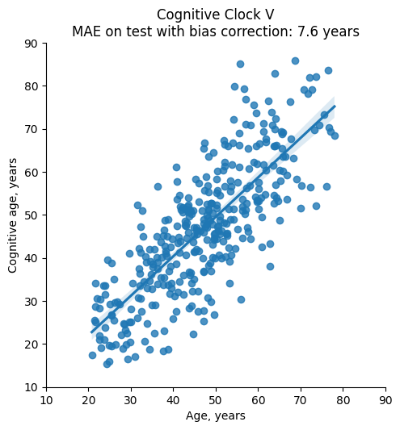

# Cognitive Clock V

This repository is consists of the code used in the paper for computation of cognitive age using API and corresponsing test part of the dataset. 

## Table of Contents

1. [Introduction](#introduction)
2. [Dataset](#dataset)
3. [Installation](#installation)
4. [Usage](#usage)
5. [Requirements](#requirements)
6. [Results](#results)
7. [License](#license)
8. [Citation](#citation)
9. [Author](#author)
10. [Contact](#contact)

## Introduction

Cognitive Clock V - is a new AI-based clock for identification of cognitive age of individual based on the 5 tests: 1-Back test, reversed letters test, arithmetic test, Stroop test and Campimetry test.

## Dataset

The prepared part of the dataset is consists of results of 363 subjects in 5 tests that measured by 23 features. 
Measurement and preprocessing procedures of corresponding features are described in detail in the paper.

## Installation

Create new virtual environment and after install the necessary packages:

```bash
pip install -r requirements.txt
```

## Usage

Open jupyter notebook file `run.ipynb` and run all cells.

## Requirements

List of necessary Python packages and their versions:

- requests>=2.31.0
- numpy>=1.26.3
- pandas>=1.5.3
- scikit-learn>=1.4.2
- seaborn>=0.11.2

## Results

As a result you see the plot of cognitive age versus age of individual with corresponding linear regression line.
Mean absolute error value of the model results is presented in the title.


## License

Copyright Lobachevsky University © 2024.
You may not use the material for commercial purposes.

## Citation

```
M.I. Krivonosov, T.A. Khabarova, E.V. Kondakova, S.A. Polevaya, M.V. Ivanchenko, C. Franceschi (2025). 
Cognitive age calculator v3.0 © Copyright 2024. 
Center of Artificial Intelligence Lobachevsky University.
```

## Author

* **Mikhail Krivonosov** - *Implementation* - [mike_live](https://github.com/mike_live)
* **Tatiana Khabarova** - *Implementation* - [enot9910](https://github.com/enot9910)
* **Elena Kondakova** -- *Participants recruitment, study organisation*
* **Tatiana Shvets** -- *Cognitive result analysis*
* **Sofia Polevaya** -- *The cognitive tests inventor, project vision*
* **Claudio Franceschi** -- *Project vision*
* **Mikhail Ivanchenko** -- *Project vision*


## Contact

Center of Artificial Intelligence Lobachevsky University.

`https://dpm-ageing.unn.ru/en/cognitive-age-calculator-v3/`